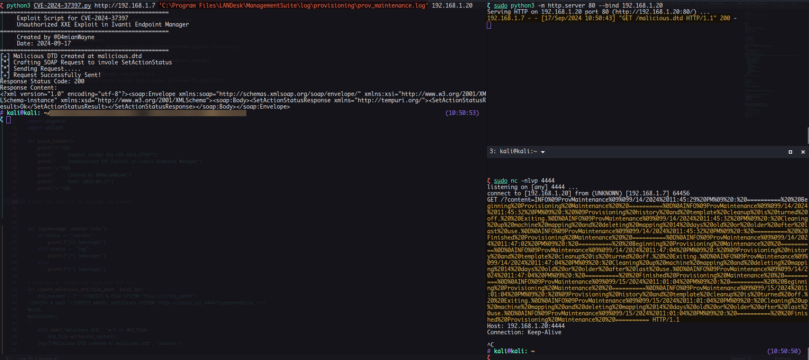

### Description:

A vulnerability in Ivanti Endpoint Manager allows remote attackers to disclose sensitive information without requiring authentication. This flaw arises from improper handling of XML External Entity (XXE) references in the `ImportXml` method. Specifically, the vulnerability is triggered by the `actionXml` parameter, which is processed during the execution of the `SetActionStatus` action via a SOAP request.

**Note**: Although a valid historyEntryIDN is necessary for exploitation, it is predictable and falls within a certain range, making it possible to brute-force. 

A detailed blog post will be released soon.

### Patch

In the patched version, `XmlResolver` was marked as `null` effectively remediating the XXE vulnerability in the affected function.

### References:

* https://www.zerodayinitiative.com/advisories/ZDI-24-1212/
* https://www.site24x7.com/learn/xxe-vulnerabilities.html
* https://forums.ivanti.com/s/article/Security-Advisory-EPM-September-2024-for-EPM-2024-and-EPM-2022