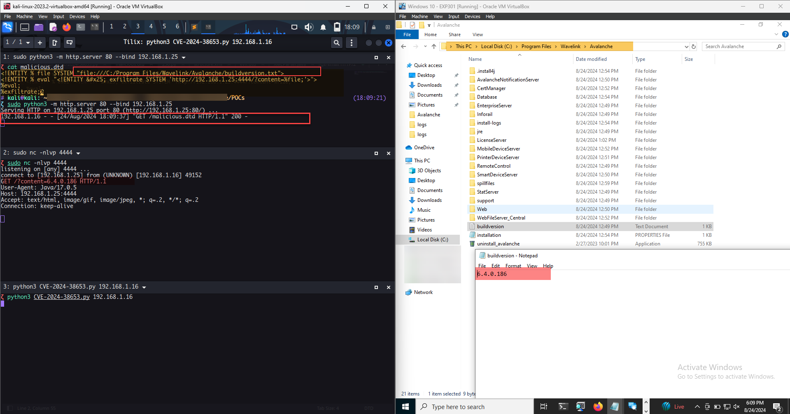

### Description

An XXE (XML External Entity) vulnerability was discovered in Ivanti Avalanche, impacting versions 6.3.1, 6.4.0 (tested), 6.4.1, and 6.3.4. This vulnerability allows an unauthenticated attacker to craft a malicious PUT request to the `/mdm/checkin` endpoint, enabling arbitrary file read operations on the affected system.

# Vulnerability Analysis

The `CheckinServlet.java`  has a `doPut` method which reads in the body of the request and pass it to the `PList.decodeToMap` method:

```java
/*     */     try {
/*  86 */       sin = Utility.readFile((InputStream)req.getInputStream());
/*     */ 
/*     */       
/*  89 */       String sessionId = req.getParameter("sessionId");
/*  90 */       String udidForVendor = req.getParameter("udid");
/*  91 */       boolean deviceSimulator = ServletUtil.parseBoolean(req.getParameter("deviceSimulator"));
/*  92 */       IDeviceAPI dapi = this.m_apiVector.getDbDeviceAPI();
/*     */       
/*  94 */       Map<String, String> pairs = PList.decodeToMap(sin);
```

The `PList.decodeToMap` method is responsible for parsing the XML input provided to it, specifically the body of the request sent in a PUT request to the `/mdm/checkin` endpoint. This method leverages the `XMLInputFactory` to create an `XMLStreamReader`, which processes the XML data.

However, by default, the `XMLInputFactory` is configured to process external entities within the XML data. This default behavior is the underlying cause of the vulnerability in this scenario. Since the external entities are not explicitly disabled, the XML parser may inadvertently process them, leading to a potential XXE (XML External Entity) vulnerability.

```java
/*     */   public static Map<String, String> decodeToMap(String xml) throws XMLStreamException {
/* 226 */     Map<String, String> pairs = new HashMap<>();
/*     */     
/* 228 */     XMLInputFactory xmlInputFactory = XMLInputFactory.newFactory();
/* 229 */     XMLStreamReader xmlStreamReader = xmlInputFactory.createXMLStreamReader(new StringReader(xml));
/*     */ 
/*     */ 
/*     */ 
/*     */ 
/*     */     
/*     */     do {
/* 236 */       xmlStreamReader.next();
/* 237 */       String name = getName(xmlStreamReader);
/* 238 */       if (name == null)
/* 239 */         continue;  String value = getValue(xmlStreamReader);
/* 240 */       if (value == null)
/* 241 */         continue;  pairs.put(name, value);
/*     */     }
/* 243 */     while (xmlStreamReader.getEventType() != 8);
/*     */     
/* 245 */     return pairs;
/*     */   }
/*     */   
```

### Exploitation

In order to exploit this vulnerability using the provided POC, you must define the file that is to be read from the targeted system along with the IP and port for your listener where the OOB connection will be made with the contents of the file being read. There's a shortcoming to this exploit, due to the way the URL is parsed by the XML library before making the HTTP request to the defined entity it truncates the `\n` character which is for new line only allowing reading of file which has just single line of data. 

Note: I will have to try the FTP approach for data exfiltration again but previously when tried, it led to same results.



# Patch

Apparently, developers scraped off the whole `ios` class from `sds_server\com\wavelink\sds\ios\*` so well, it's patched.

### References:

* https://forums.ivanti.com/s/article/Security-Advisory-Ivanti-Avalanche-6-4-4-CVE-2024-38652-CVE-2024-38653-CVE-2024-36136-CVE-2024-37399-CVE-2024-37373?language=en_US
* https://www.zerodayinitiative.com/advisories/ZDI-24-1150/