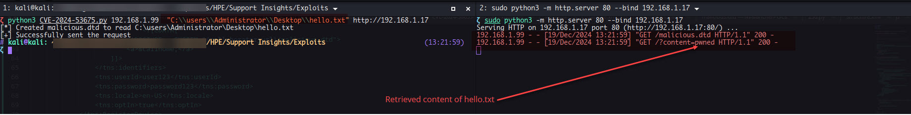

# Description

As per ZDI Advisory:

> This vulnerability allows remote attackers to disclose sensitive information on affected installations of Hewlett Packard Enterprise Insight Remote Support. Authentication is not required to exploit this vulnerability.
> The specific flaw exists within the implementation of the validateAgainstXSD method. Due to the improper restriction of XML External Entity (XXE) references, a crafted document specifying a URI causes the XML parser to access the URI and embed the contents back into the XML document for further processing. An attacker can leverage this vulnerability to disclose files in the context of SYSTEM.

This vulnerability is as mentioned an unauthenticated XXE vulnerability, the problem stems from `validateAgainstXSD` , this function belonged to `uacore` library which had number of utilities funtion, one of them was `validateAgainstXSD`. The deivce registration SOAP request () expects XML content within `identifier` parameter, this later gets passed to `com\hp\it\sa\helpers\RegisterDeviceHelper.java` class having `validateDeviceIDsXML` which later passses the XML content to `validateAgainstXSD`. As we can see, the `validateAgainstXSD` does not have any predefined rules for blocking DTDs and entitites.


```java
  public static UCAXMLParseErrorhandler validateAgainstXSD(InputStream xsdSchemaStream, InputStream xmlInstanceStream, XMLFilterImpl nameSpaceFilter, String xsdPath) throws Exception {
    UCAXMLParseErrorhandler xmlParseErrorhandler = new UCAXMLParseErrorhandler();
    SchemaFactory factory = SchemaFactory.newInstance("http://www.w3.org/2001/XMLSchema");
    Source schemaFile = new StreamSource(xsdSchemaStream);
    factory.setResourceResolver(new ResourceResolver(xsdPath));
    try {
      Schema xsdSchema = factory.newSchema(schemaFile);
      Validator validator = xsdSchema.newValidator();
      SAXSource source = new SAXSource(nameSpaceFilter, new InputSource(xmlInstanceStream));
      validator.setErrorHandler(xmlParseErrorhandler);
      validator.validate(source, null);
      logger.debug("validateAgainstXSD: xmlParseErrorhandler.isValid = {}", Boolean.valueOf(xmlParseErrorhandler.isValid));
    } catch (SAXException e) {
      logger.error("validateAgainstXSD:", e);
      throw e;
    } catch (IOException e) {
      logger.error("validateAgainstXSD: ", e);
      throw e;
    } 
    return xmlParseErrorhandler;
  }
```

